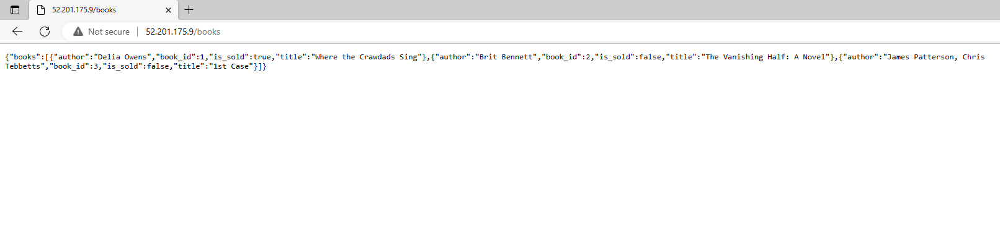
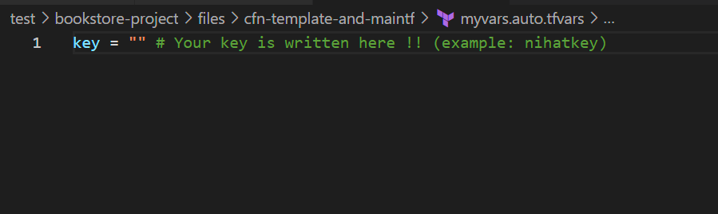

BOOKSTORE PROJECT

Description:

With this project, I aimed to create a Bookstore Web API Application with MySQL created a bookstore web service using Docker for containerization of an application. The application code is deployed as a RESTful web service with Flask using Dockerfile and Docker Compose on AWS EC2 Instance using Cloud formation and Terraform

Roadmap: 

Output: 

Indexpage

Bookspage

NOTE: You must customize your variable in myvars.auto.tfvars file.

